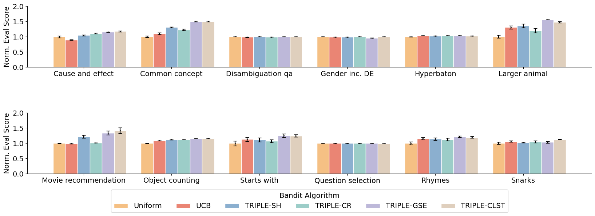

# Best Arm Identification for Prompt Learning under a Limited Budget

Welcome to TRIPLE's prompt learning world! 

## Introduction

Welcome to our repository! This repository contains the code and resources for our paper on "Best Arm Identification for Prompt Learning under a Limited Budget". In this paper, we explore the application of best arm identification algorithms in the prompt learning process for large language models.



## Code Overview

Our code is structured as follows:

- `collect_baseline.py`: Script for collecting baseline data.
- `bandit_exp.py`: Script for running bandit experiments.
- `src`: Source code directory.
   - `bandit`: Directory for bandit algorithms.
      - `baseline`: Directory for baseline algorithms.
         - `TopK (Uniform)`: Implementation of the TopK (Uniform) algorithm.
      - `contextual`: Directory for contextual bandit algorithms.
         - `GSE`: Implementation of the GSE algorithm.
      - `stochastic`: Directory for stochastic bandit algorithms.
         - `UCB`: Implementation of the UCB algorithm.
         - `SequentialHalving`: Implementation of the Sequential Halving algorithm.
         - `ContinuousRejects`: Implementation of the Continuous Rejects algorithm.
   - `LLM`: Directory for large language models.
      - `ChatGPT`: Implementation of the ChatGPT model.
      - `Whitebox`: Implementation of the Whitebox model.
   - `utils`: Directory for utility functions.
   - `constants.py`: File containing constants used in the code.
   - `env.py`: File containing environment setup functions.


### Environment Setup
To set up the necessary environment, follow these steps:

1. Create a virtual python environment:
   ```
   git clone [Your Repo URL]
   ```
2. Install the required dependencies:
   ```
   pip install -r requirements.txt
   ```

### Additiopnal dependency


To run the experiments, please make sure you have one of the following:

1. OpenAI API Key: You will need your own OpenAI API key to access the language models. If you don't have one, you can sign up for an account and obtain the key from the OpenAI website.

2. Whitebox Language Model: If you want to use the Whitebox language model, you will need to download it from the Hugging Face model hub. Instructions on how to download and set up the Whitebox model can be found on the [Hugging Face website](https://huggingface.co/).

Please ensure that you have these prerequisites before running the experiments.


## Running the Experiments

To generate prompts, generate the embeddings and perform the clustering process, simply run

```
bash data_collection.sh
```

After collecting the prompts, run this script to compare different BAI algorithm's performance:

```
bash main_exp.sh
```

### Customization

You can customize the experiments by changing `config.json` or specify inputs in `main_exp.sh`

## Results
[TODO.]

## Citing Our Work
[TODO.]

## Contact
[TODO.]

## Acknowledgements
We have referenced the following repos for code development:

[APE](https://github.com/keirp/automatic_prompt_engineer)
[InstructZero](https://github.com/Lichang-Chen/InstructZero)
[APO](https://github.com/microsoft/LMOps/tree/main/prompt_optimization)


